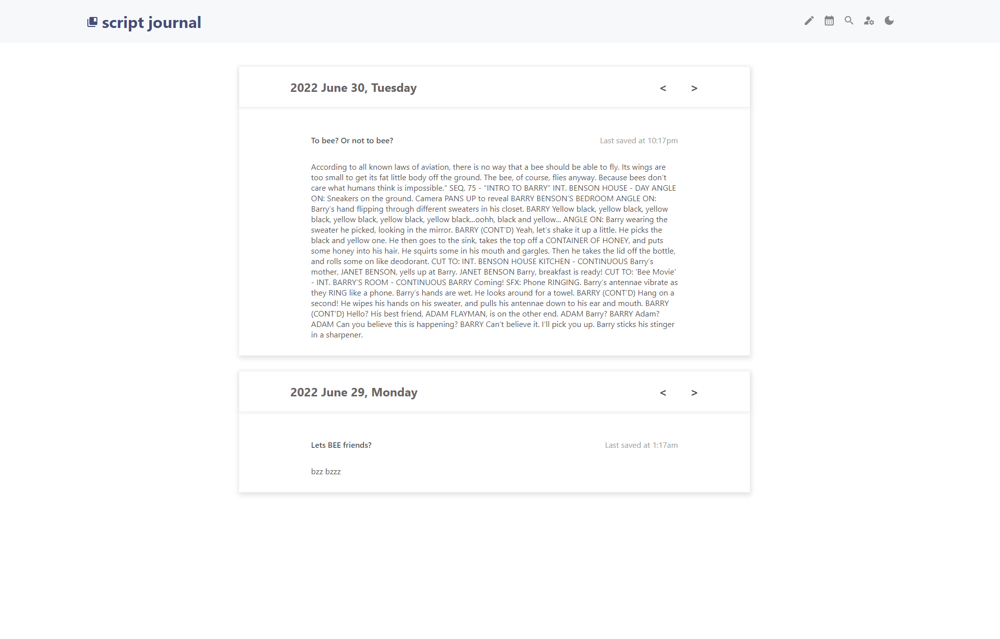

## About
Script ([live app here](https://script-vert.vercel.app/)) is a lightweight journaling application built with the framework [Next.js](https://nextjs.org/) project bootstrapped with [`create-next-app`](https://github.com/vercel/next.js/tree/canary/packages/create-next-app).

Currently, the application is making its way towards a functional demo app, stay tuned for the full version!

## Tech Stack:
Frontend: React.js, HTML, CSS, Next.js, create-react-app
Backend: Vercel (deployment)

## Requirements:
After cloning/downloading this package from github, you will need node.js and npm (Node Package Manager) to install the required dependencies!

## Steps to launching a local client:


1. Clone the repository under the green "Code" button.
2. Navigate to the local folder path: /script/.... 
3. create a .env file in the top level folder structure (path: script/.env) like below:
```
PORT=4000
```
4. run the command `npm install` and let the packages build.
5. run the command `npm start`
6. Depending on the port you've input into the .env file, navigate to [http://localhost:4000](http://localhost:4000) 
7. Have fun with the local client (not connected to the internet).

V1 edition of Script: 

